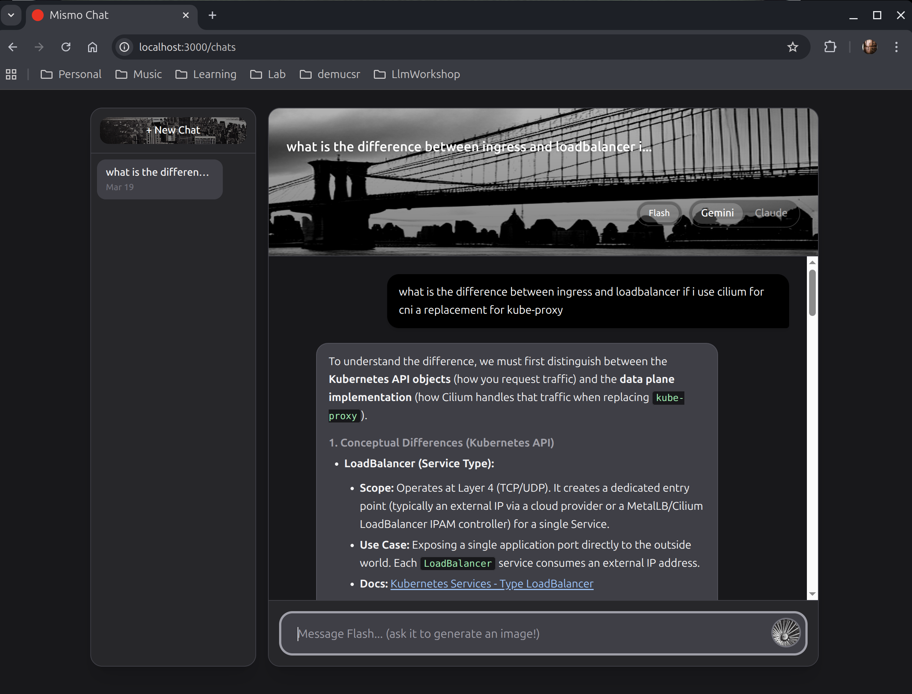

# Mismo Chat

A Rails chat app tuned for software engineering and DevOps questions, with support for Google Gemini, Anthropic Claude, local Ollama models, and a local Stable Diffusion image generator running on your GPU.



## Stack

- Ruby on Rails 8.1
- PostgreSQL
- Google Gemini 3.1 Flash Lite Preview API (chat)
- Anthropic Claude API — Sonnet 4.6 or Opus 4.6 (chat)
- Ollama — any locally installed model via `http://host.docker.internal:11434` (chat)
- Stable Diffusion XL via local FastAPI/PyTorch service (image generation)
- Docker / Docker Compose

## Requirements

- Docker and Docker Compose
- An NVIDIA GPU with the [NVIDIA Container Toolkit](https://docs.nvidia.com/datacenter/cloud-native/container-toolkit/latest/install-guide.html) installed and configured
- A [Google AI Studio](https://aistudio.google.com/) API key (Free Tier)
- An [Anthropic](https://console.anthropic.com/) API key (optional — only needed if you want to use Claude)
- A [HuggingFace](https://huggingface.co/) account and API token (Free Tier, just so you can download Stable Diffusion)
- [Ollama](https://ollama.com/) installed and running on the host (optional — only needed for local model support)

### NVIDIA Container Toolkit (WSL2 / Linux)

Install and configure the toolkit so Docker can access your GPU:

```bash
curl -fsSL https://nvidia.github.io/libnvidia-container/gpgkey \
  | sudo gpg --dearmor -o /usr/share/keyrings/nvidia-container-toolkit-keyring.gpg

curl -s -L https://nvidia.github.io/libnvidia-container/stable/deb/nvidia-container-toolkit.list \
  | sed 's#deb https://#deb [signed-by=/usr/share/keyrings/nvidia-container-toolkit-keyring.gpg] https://#g' \
  | sudo tee /etc/apt/sources.list.d/nvidia-container-toolkit.list

sudo apt-get update && sudo apt-get install -y nvidia-container-toolkit
sudo nvidia-ctk runtime configure --runtime=docker
sudo service docker restart
```

> **Note:** Driver version 555+ on WSL2 requires nvidia-container-toolkit v1.15.0 or newer. Older versions will fail with `Error 500: named symbol not found` when PyTorch tries to initialize CUDA.

## Setup

**1. Create a `.env` file:**

```
GEMINI_API_KEY=your_gemini_api_key
ANTHROPIC_API_KEY=your_anthropic_api_key   # optional — only needed for Claude
HF_TOKEN=your_huggingface_token
POSTGRES_USER=mismo_chat
POSTGRES_PASSWORD=your_password_here
SECRET_KEY_BASE=your_secret_key_base_here
```

Generate a secret key base with:
```bash
openssl rand -hex 64
```

**2. Build and start everything:**

```bash
docker compose up --build -d
```

This will:
- Build the Rails web container and the Stable Diffusion container
- Start PostgreSQL, the Rails app on port 3000, and the SD service on port 8000
- Run database migrations automatically on startup
- Compile Tailwind CSS

**3. Wait for Stable Diffusion to be ready:**

On first run, the SD service downloads the SDXL model weights (~7GB from HuggingFace):

```bash
docker compose logs -f sd
```

Wait for `Uvicorn running on http://0.0.0.0:8000` before trying to generate images.

The app is available at `http://localhost:3000`.

## Usage

### Chat

Talk to Google Gemini or Anthropic Claude. Both models are configured as a senior software engineer and DevOps specialist with a focus on Kubernetes, RKE2, cloud-native infrastructure, and multi-language development. They cite official documentation sources and give production-grade answers rather than toy examples.

The full conversation history is sent with each request so the model has context. Type your message in the input box — it supports multiple lines (Enter for new line) and auto-resizes as you type.

Use the toggle in the chat header to switch between Gemini, Claude, and Ollama at any time.

**Gemini** runs on the [free tier of Google AI Studio](https://aistudio.google.com/) — no billing required. Uses `gemini-3.1-flash-lite-preview`.

**Claude** requires an [Anthropic API key](https://console.anthropic.com/) and offers two model options:
- **Sonnet 4.6** — fast and capable (default)
- **Opus 4.6** — most capable, slower

**Ollama** connects to a locally running Ollama instance on the host machine at `http://host.docker.internal:11434`. Any models you have pulled with `ollama pull <model>` will appear in the model selector automatically. No API key required.

```bash
ollama pull llama3.2      # example — pull any model you want
```

You can override the Ollama host via the `OLLAMA_HOST` environment variable if your instance runs elsewhere.

### Conversations

Each chat is saved as a named conversation. The sidebar lists all past conversations; click any to resume it, or use **+ New Chat** to start fresh. Conversations are auto-titled from the first message and can be deleted individually.

### Inline image generation from chat

You can ask any model to generate an image directly in the chat. The model returns a structured image prompt, which is enhanced by the active AI provider and sent to the local Stable Diffusion XL service. The resulting image appears inline in the conversation — nothing is sent to any external image API.

You can include size hints in your request and the model will use the appropriate dimensions:
- `iphone wallpaper` / `portrait` / `phone` → 768×1344
- `landscape` / `widescreen` / `16:9` → 1344×768
- `square` / `1:1` → 1024×1024

### Standalone image generator

Click **Generate Image** from the chat header to open the dedicated image generator.

Enter a short description of what you want. You can optionally click **AI Enhance** to have Claude (or Gemini, matching your current chat toggle) rewrite your description into a detailed, optimized Stable Diffusion prompt before generating.

Click **Generate & Download** to render the image locally on your GPU and download it.

## Rebuilding after code changes

CSS changes require a manual rebuild inside the container:

```bash
docker compose exec web bin/rails tailwindcss:build
```

For all other changes (Ruby, ERB, etc.), Rails reloads automatically in development — no restart needed.
